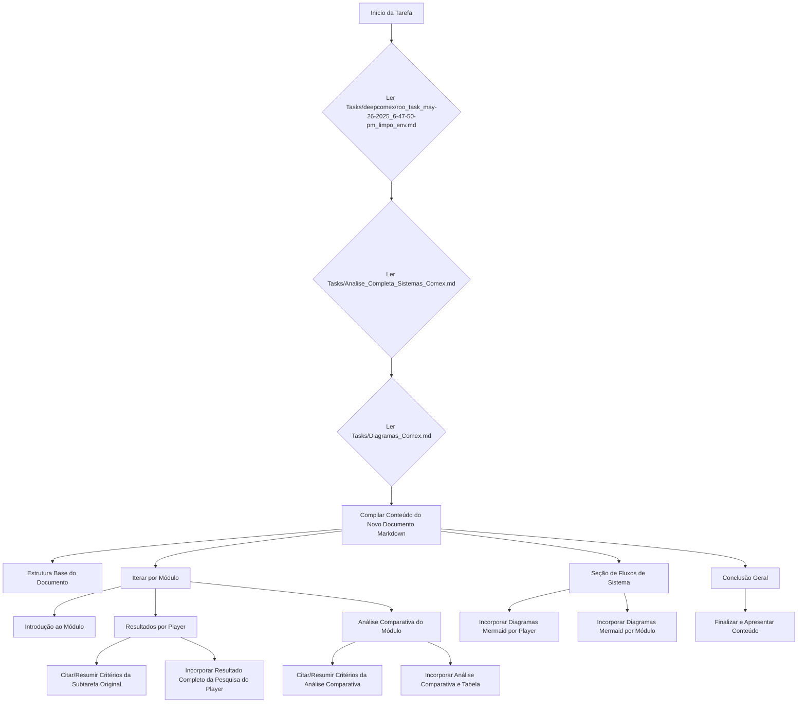

# Plano para Criação do Documento Markdown Consolidado de Sistemas de Comércio Exterior

Este plano detalha as etapas para consolidar os resultados da pesquisa sobre sistemas de comércio exterior em um único documento Markdown, integrando informações de três arquivos de origem:

1.  `Tasks/deepcomex/roo_task_may-26-2025_6-47-50-pm_limpo_env.md` (arquivo original da tarefa com a sequência de subtarefas e objetivos).
2.  `Tasks/Analise_Completa_Sistemas_Comex.md` (arquivo consolidado com resultados de pesquisa e análises comparativas).
3.  `Tasks/Diagramas_Comex.md` (arquivo com os diagramas Mermaid).

## Estrutura do Plano:

## Detalhamento das Etapas:

### 1. Estrutura Base do Documento Consolidado:

- O novo documento Markdown será iniciado com o título principal: `# Análise Abrangente dos Módulos de Sistemas de Comércio Exterior e Comparativo de Players no Brasil`.
- Será incluída a introdução geral e a lista de "Módulos Analisados" extraídas do arquivo `Tasks/Analise_Completa_Sistemas_Comex.md`.

### 2. Iteração por Módulo:

- Para cada módulo identificado na pesquisa (Gestão de Importação, Gestão de Exportação, Classificação Fiscal (NCM), Câmbio e Financeiro, Drawback, Integração com Sistemas Governamentais, Logística e Frete, Compliance e Legislação, Gestão de Documentos, Relatórios e Indicadores (BI)), as seguintes sub-etapas serão executadas:

    #### 2.1. Introdução ao Módulo:
        - Será adicionada uma breve introdução para cada módulo. Se uma introdução específica estiver disponível em `Tasks/Analise_Completa_Sistemas_Comex.md`, ela será utilizada; caso contrário, uma introdução concisa será gerada.

    #### 2.2. Resultados por Player:
        - Para cada um dos 6 players (Logcomex, Fazcomex, Conexos, Thomson Reuters, Bysoft, GetGlobal) dentro do módulo atual:
            - Os "critérios/objetivos da subtarefa original de pesquisa" para aquele player e módulo serão citados ou resumidos, utilizando blockquotes para clareza. Esta informação será extraída do arquivo `Tasks/deepcomex/roo_task_may-26-2025_6-47-50-pm_limpo_env.md`.
            - O "resultado completo da pesquisa" para o player e módulo será incorporado. Esta informação também será extraída do arquivo `Tasks/deepcomex/roo_task_may-26-2025_6-47-50-pm_limpo_env.md`.

    #### 2.3. Análise Comparativa do Módulo:
        - Os "critérios/objetivos da subtarefa de análise comparativa" para o módulo serão citados ou resumidos, se disponíveis em `Tasks/deepcomex/roo_task_may-26-2025_6-47-50-pm_limpo_env.md`.
        - A "análise comparativa completa e a tabela Markdown" correspondente ao módulo serão incorporadas. Ambas serão extraídas do arquivo `Tasks/Analise_Completa_Sistemas_Comex.md`.

### 3. Seção de Fluxos de Sistema:

- Uma nova seção será criada com o título `## Fluxos de Sistema`.
- Dentro desta seção, haverá um subtítulo `### Fluxo por Player`. Para cada player, o código Mermaid do diagrama de fluxo correspondente será incorporado, garantindo a formatação correta para renderização.
- Em seguida, um subtítulo `### Fluxo por Módulo` será adicionado. Para cada módulo, o código Mermaid do diagrama de fluxo correspondente será incorporado, também com a formatação adequada.
- Todos os códigos Mermaid serão extraídos do arquivo `Tasks/Diagramas_Comex.md`.

### 4. Conclusão Geral:

- A seção final do documento será a "Conclusão Geral e Tendências", cujo conteúdo será extraído diretamente do final do arquivo `Tasks/Analise_Completa_Sistemas_Comex.md`.

## Formato e Estilo:

- Será utilizada formatação Markdown clara e consistente (títulos, subtítulos, listas, tabelas, blockquotes).
- A narrativa será fluida e coesa, conectando as diferentes seções para garantir uma leitura lógica.
- As citações dos critérios das subtarefas fornecerão contexto sobre a apresentação de cada resultado.

## Restrições:

- Não serão realizadas novas pesquisas ou análises. O foco é estritamente na estruturação e consolidação do conteúdo dos arquivos fornecidos.
- Se houver ambiguidades ou informações faltantes nos arquivos de origem que impeçam a consolidação, elas serão sinalizadas.
