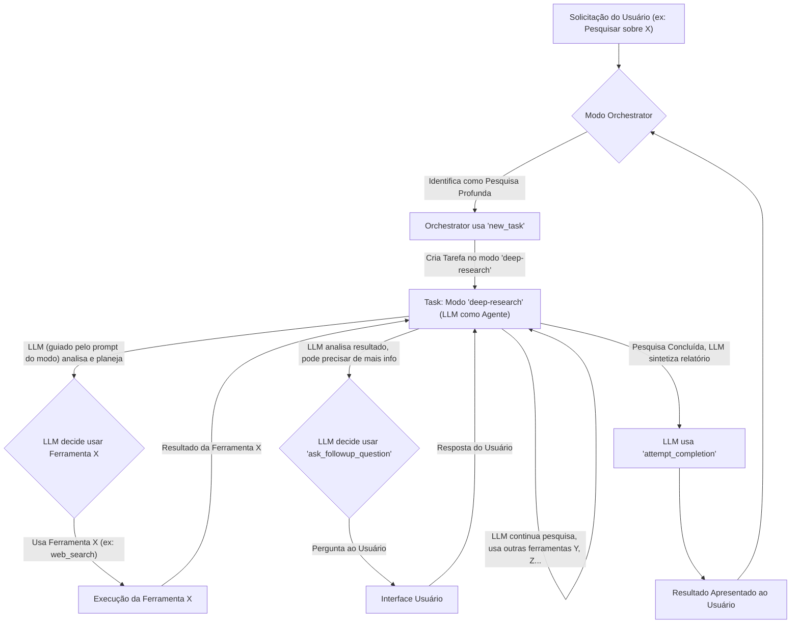

O usuário forneceu a lista de `utils` do `node-DeepResearch-nexcode`. Vamos analisar:

- `action-tracker.ts`: Provavelmente para rastrear as ações do agente. No Roo, o histórico da conversa e o log de uso de ferramentas já cumprem uma função similar.
- `date-tools.ts`: Utilitários de data. O Roo pode usar bibliotecas JS padrão ou `moment.js`/`date-fns` se necessário.
- `i18n.json`: Arquivo de internacionalização. O Roo já tem seu próprio sistema i18n em `src/i18n`.
- `safe-generator.ts`: Pode ser para gerar IDs ou dados de forma segura. O Roo usa `crypto.randomUUID`.
- `schemas.ts`: Definições de schema, provavelmente Zod. O Roo usa Zod extensivamente em `src/schemas/index.ts`.
- `text-tools.ts`: Utilitários de texto. O Roo tem `src/utils/text-normalization.ts`. Se houver funcionalidades específicas em `text-tools.ts` que não existem no Roo (ex: sumarização avançada, extração de entidades complexas que não sejam responsabilidade do LLM), elas poderiam ser portadas para `src/utils` do Roo ou se tornar uma nova ferramenta `process_text` se forem complexas e o LLM precisar invocá-las.
- `token-tracker.ts`: Para rastrear tokens. O Roo já calcula o uso de tokens (`TokenUsage` em `src/schemas/index.ts`, lógica em `src/shared/getApiMetrics.ts` e na classe `Task`).
- `url-tools.ts`: Utilitários para URLs (parsing, validação, normalização). O Roo pode usar a classe `URL` nativa do Node.js ou bibliotecas como `url-parse`.

**Conclusão da Análise das `utils` do Agente Externo:**
A maioria das funcionalidades das `utils` do `node-DeepResearch-nexcode` parece ter equivalentes existentes no Roo Code ou pode ser implementada usando bibliotecas padrão JavaScript/Node.js. A `text-tools.ts` é a candidata mais provável a ter lógica que poderia ser portada para `src/utils/text-normalization.ts` do Roo ou, se envolver operações complexas que o LLM deva controlar, inspirar uma nova ferramenta `process_text`.

**Retomada do Plano e Refinamento das Ferramentas Roo:**

Com base na lista de _ferramentas_ e _utils_ do seu agente, e mantendo a abordagem de ferramentas Roo granulares orquestradas por um modo `deep-research`, podemos refinar a lista de **novas ferramentas Roo** a serem criadas:

1.  **`web_search`**

    - **Descrição:** Realiza uma busca na web usando um motor configurado (ou uma API de busca como Jina, Serper, Brave Search se o usuário configurar chaves de API para elas nas configurações do Roo). Retorna uma lista de resultados (título, link, snippet).
    - **Parâmetros:** `query: string`, `engine?: string` (opcional, ex: "google", "brave", "jina", "serper", default pode ser um fallback genérico ou requerer configuração), `num_results?: number`.
    - **Mapeia para:** `brave-search.ts`, `jina-search.ts`, `serper-search.ts`.

2.  **`extract_webpage_content`**

    - **Descrição:** Dada uma URL, extrai o conteúdo textual principal da página, opcionalmente tentando limpar boilerplate. Pode usar internamente a capacidade do `browser_action` ou uma biblioteca de extração de conteúdo.
    - **Parâmetros:** `url: string`, `clean_html?: boolean` (default: true).
    - **Mapeia para:** Funcionalidade implícita em `read.ts` (se lida com URLs) e complementa `browser_action`.

3.  **`extract_document_content`** (Conforme proposto anteriormente)

    - **Descrição:** Extrai texto de arquivos locais ou URLs de documentos (PDF, DOCX, TXT).
    - **Parâmetros:** `source: string` (path ou URL), `format?: string` (opcional, para ajudar na identificação).
    - **Mapeia para:** `read.ts` (para formatos de documento).

4.  **`search_structured_data`** (Conforme proposto anteriormente)

    - **Descrição:** Busca em arquivos de dados estruturados locais (JSON, JSONL, CSV).
    - **Parâmetros:** `path: string`, `query: string`, `format: string`, `criteria?: object`.

5.  **`search_code_repositories`** (Conforme proposto anteriormente)

    - **Descrição:** Busca em plataformas de código (inicialmente GitHub).
    - **Parâmetros:** `platform: string` (default: "github"), `query: string`, `search_type?: string` ("repositories", "code"), `filters?: object`.

6.  **`get_repository_file_content`** (Renomeado de `get_repository_content` para clareza)

    - **Descrição:** Obtém o conteúdo de um arquivo específico de um repositório.
    - **Parâmetros:** `platform: string` (default: "github"), `repository_id: string`, `file_path: string`, `branch?: string`.

7.  **`process_text` (Nova, opcional, baseada em `text-tools.ts` e fixers)**
    - **Descrição:** Realiza operações de processamento de texto, como correção de formatação, remoção de duplicatas (se aplicável a um único bloco de texto), sumarização simples (se não for deixado para o LLM).
    - **Parâmetros:** `text_content: string`, `operations: string[]` (ex: ["fix_markdown", "remove_duplicate_lines", "fix_broken_chars"]).
    - **Mapeia para:** `broken-ch-fixer.ts`, `md-fixer.ts`, `dedup.ts`.
    - **Nota:** Muitas dessas operações podem ser feitas pelo LLM diretamente. Esta ferramenta seria para casos onde uma lógica programática específica é mais eficiente ou confiável.

**Ferramentas do `node-DeepResearch-nexcode` que NÃO se tornam ferramentas Roo diretas (tratadas pelo LLM ou são internas/configuração):**

- `code-sandbox.ts`: Se necessário, via [`execute_command`](src/core/tools/executeCommandTool.ts:1) para scripts locais ou um MCP dedicado.
- `error-analyzer.ts`, `evaluator.ts`, `grounding.ts`, `query-rewriter.ts`: Tarefas cognitivas para o LLM no modo `deep-research`.
- `jina-classify-spam.ts`: O LLM pode ser instruído a identificar/ignorar spam. Se for uma necessidade crítica, uma ferramenta `classify_text` poderia ser considerada, possivelmente usando um modelo externo.
- `jina-dedup.ts` (para listas), `jina-latechunk.ts`, `jina-rerank.ts`: Podem ser funcionalidades internas das ferramentas de busca/extração ou utilities, ou o LLM pode ser instruído a realizar o re-ranking.

O plano geral de ter um modo `deep-research` que guia o LLM a usar essas ferramentas granulares permanece o mesmo. A lista de `utils` fornecida reforça que muitas funcionalidades de suporte já existem no Roo ou são padrão.

Agora que analisamos as ferramentas e utils do seu agente, e os principais arquivos da arquitetura Roo, podemos finalizar o plano de arquitetura.

Obrigado por fornecer a lista de `utils` do seu `node-DeepResearch-nexcode`. Isso nos ajuda a entender melhor quais funcionalidades de suporte seu agente utiliza e como elas podem ser mapeadas para a estrutura do Roo Code.

Analisando a lista de `utils`:

- `action-tracker.ts`: O Roo Code já possui mecanismos de log e histórico de tarefas que cobrem o rastreamento de ações.
- `date-tools.ts`: Funcionalidades de data podem ser implementadas usando bibliotecas padrão JavaScript (como `Date`) ou bibliotecas como `date-fns` se manipulações mais complexas forem necessárias dentro das novas ferramentas ou utilities do Roo.
- `i18n.json`: O Roo Code já possui seu próprio sistema de internacionalização em [`src/i18n`](src/i18n).
- `safe-generator.ts`: Para geração de IDs ou dados seguros, o Roo utiliza `crypto.randomUUID()` e outras primitivas criptográficas conforme necessário.
- `schemas.ts`: O Roo Code utiliza Zod para definição de schemas em [`src/schemas/index.ts`](src/schemas/index.ts:1).
- `text-tools.ts`: Funcionalidades de manipulação de texto. O Roo possui [`src/utils/text-normalization.ts`](src/utils/text-normalization.ts). Se houver funcionalidades específicas em `text-tools.ts` (ex: sumarização muito específica, extração de entidades complexas que não são responsabilidade do LLM, ou correções de formatação como as vistas em `broken-ch-fixer.ts` e `md-fixer.ts` da sua lista de ferramentas) que não são cobertas, elas podem ser:
    1.  Adicionadas a [`src/utils/text-normalization.ts`](src/utils/text-normalization.ts) ou um novo utilitário de texto no Roo.
    2.  Se forem operações que o LLM deve invocar explicitamente, poderiam inspirar uma nova ferramenta Roo granular como `process_text_content` (com sub-operações como `fix_markdown`, `remove_duplicate_lines`).
- `token-tracker.ts`: O Roo Code já gerencia o rastreamento de tokens para as chamadas de API do LLM (vide `TokenUsage` em [`src/schemas/index.ts`](src/schemas/index.ts:1) e lógica associada).
- `url-tools.ts`: Para manipulação de URLs, o Roo pode usar a classe `URL` nativa do Node.js ou bibliotecas padrão.

**Conclusão da Análise de Ferramentas e Utilitários Externos:**

A maioria das funcionalidades das `utils` do seu agente externo já possui equivalentes no Roo Code ou pode ser facilmente implementada com bibliotecas padrão. As "ferramentas" do seu agente externo mapeiam para um conjunto de novas ferramentas Roo granulares que podemos criar, focadas na coleta e extração de dados. As tarefas mais cognitivas (análise, avaliação, reescrita de queries, etc.) serão responsabilidade do LLM operando no modo `deep-research`.

**Plano de Arquitetura Finalizado (Nativo no Roo Code):**

1.  **Novas Ferramentas Roo Granulares:**

    - Serão implementadas em `/Users/williamduarte/NCMproduto/elaiRoo/src/core/tools` com prompts correspondentes em `/Users/williamduarte/NCMproduto/elaiRoo/src/core/prompts/tools`.
    - **`web_search`**:
        - **Descrição:** Realiza busca na web (ex: via API configurada como Jina/Serper/Brave, ou usando [`browser_action`](src/core/tools/browserActionTool.ts:1) para simular busca em Google/DDG se nenhuma API estiver configurada). Retorna lista de resultados (título, link, snippet).
        - **Parâmetros:** `query: string`, `engine?: string` (opcional), `num_results?: number`.
        - **Mapeia para:** `brave-search.ts`, `jina-search.ts`, `serper-search.ts`.
    - **`extract_page_content`** (Combina extração de HTML e documentos):
        - **Descrição:** Dada uma URL ou caminho de arquivo local, extrai o conteúdo textual principal. Suporta HTML, PDF, DOCX, TXT.
        - **Parâmetros:** `source: string` (URL ou caminho do arquivo), `format?: string` (opcional, para ajudar na identificação do tipo de documento).
        - **Mapeia para:** `read.ts` (para documentos e potencialmente URLs), complementa [`browser_action`](src/core/tools/browserActionTool.ts:1).
    - **`search_structured_data`**:
        - **Descrição:** Busca em arquivos de dados estruturados locais (JSON, JSONL, CSV).
        - **Parâmetros:** `path: string`, `query: string`, `format: string` (ex: "jsonl", "csv"), `criteria?: object` (para filtros específicos do formato).
    - **`search_code_repositories`**:
        - **Descrição:** Busca em plataformas de código (inicialmente GitHub via API).
        - **Parâmetros:** `platform: string` (default: "github"), `query: string`, `search_type?: string` (ex: "repositories", "code"), `filters?: object` (ex: linguagem, estrelas).
    - **`get_repository_file_content`**:
        - **Descrição:** Obtém o conteúdo de um arquivo específico de um repositório (inicialmente GitHub via API).
        - **Parâmetros:** `platform: string` (default: "github"), `repository_id: string` (ex: "owner/repo"), `file_path: string`, `branch?: string`.
    - **(Opcional) `process_text_content`**:
        - **Descrição:** Aplica operações de limpeza/formatação a um texto.
        - **Parâmetros:** `text_content: string`, `operations: string[]` (ex: "fix_markdown", "fix_broken_chars").
        - **Mapeia para:** `broken-ch-fixer.ts`, `md-fixer.ts`. Muitas dessas tarefas podem ser deixadas para o LLM.

2.  **Novo Grupo de Ferramentas (`deepSearchTools`):**

    - Definido em `src/shared/tools.ts`, listando as novas ferramentas acima.

3.  **Novo Modo Especializado (`deep-research`):**

    - Configurado em `src/shared/modes.ts`.
    - **Prompt de Sistema Detalhado:** Guiará o LLM através de um workflow iterativo de pesquisa (Analisar -> Planejar -> Coletar Dados com Ferramentas -> Analisar Resultados -> Iterar/Refinar com [`ask_followup_question`](src/core/tools/askFollowupQuestionTool.ts:1) -> Sintetizar -> Apresentar com [`attempt_completion`](src/core/tools/attemptCompletionTool.ts:1)). O LLM será instruído a usar as ferramentas do grupo `deepSearchTools` e outras ferramentas Roo relevantes.
    - **Grupos de Ferramentas Acessíveis:** `deepSearchTools`, `read`, `browser`, `ask`, `completion`, e opcionalmente `edit`.

4.  **Orquestração:**

    - O modo Orchestrator identificará solicitações de pesquisa profunda e delegará ao modo `deep-research` usando [`new_task`](src/core/tools/newTaskTool.ts:1). A `Task` resultante será gerenciada pelo [`ClineProvider.ts`](src/core/webview/ClineProvider.ts:1).

5.  **Registro e Schemas:**
    - Todas as novas ferramentas serão adicionadas ao `toolDescriptionMap` em `src/core/prompts/tools/index.ts` e ao `toolNamesSchema` em `src/schemas/index.ts`.

Este plano finalizado foca em criar um conjunto modular de ferramentas de pesquisa nativas no Roo, com a inteligência do "agente" residindo no prompt bem elaborado do modo `deep-research`, que guiará o LLM no uso dessas ferramentas para realizar pesquisas complexas.

**Diagrama de Fluxo (Conceitual):**

# Plano de Arquitetura: Implementação Nativa de Pesquisa Profunda no Roo Code

**Data:** 20 de Maio de 2025

**Autor:** Roo (Modo Arquiteto)

**Versão:** 1.0

## 1. Objetivo Principal

Capacitar o Roo Code a realizar pesquisas profundas e iterativas de forma nativa, eliminando a necessidade de comunicação com agentes externos para esta funcionalidade. O Large Language Model (LLM), operando em um novo modo especializado (`deep-research`), orquestrará o fluxo de trabalho da pesquisa. Este fluxo envolverá o uso de um conjunto de novas ferramentas granulares implementadas diretamente no Roo Code, bem como ferramentas existentes.

## 2. Componentes da Arquitetura

### 2.1. Novas Ferramentas Roo Granulares

As seguintes ferramentas serão implementadas no diretório `/Users/williamduarte/NCMproduto/elaiRoo/src/core/tools` e terão seus respectivos prompts de descrição em `/Users/williamduarte/NCMproduto/elaiRoo/src/core/prompts/tools`.

#### 2.1.1. `web_search`

- **Descrição:** Realiza uma busca na web. Pode utilizar uma API de busca configurada pelo usuário (ex: Jina, Serper, Brave Search, via chaves de API nas configurações do Roo) ou, como fallback, usar a ferramenta [`browser_action`](src/core/tools/browserActionTool.ts:1) existente para simular uma busca em motores como Google ou DuckDuckGo. Retorna uma lista de resultados contendo título, link e snippet.
- **Parâmetros:**
    - `query: string` (obrigatório): O termo ou pergunta da busca.
    - `engine?: string` (opcional): Especifica o motor de busca a ser usado, se múltiplas APIs estiverem configuradas (ex: "google", "brave", "jina").
    - `num_results?: number` (opcional, default: 5): Número de resultados a serem retornados.
- **Mapeamento para `node-DeepResearch-nexcode`:** `brave-search.ts`, `jina-search.ts`, `serper-search.ts`.

#### 2.1.2. `extract_page_content`

- **Descrição:** Dada uma URL de uma página web ou um caminho para um arquivo HTML local, extrai o conteúdo textual principal. Tenta remover boilerplate (menus, anúncios, rodapés) para focar no conteúdo relevante.
- **Parâmetros:**
    - `source: string` (obrigatório): A URL da página web ou o caminho para o arquivo HTML local.
    - `extract_tables_as_markdown?: boolean` (opcional, default: `false`): Se `true`, tenta converter tabelas HTML em formato Markdown.
- **Mapeamento para `node-DeepResearch-nexcode`:** Funcionalidade de leitura de conteúdo web implícita em `read.ts` e complementa a ferramenta [`browser_action`](src/core/tools/browserActionTool.ts:1) do Roo.

#### 2.1.3. `extract_document_content`

- **Descrição:** Extrai texto de arquivos de documentos locais ou hospedados em URLs. Suporta formatos como PDF, DOCX e TXT.
- **Parâmetros:**
    - `source: string` (obrigatório): Caminho do arquivo local ou URL do documento.
    - `format?: string` (opcional): Formato explícito do documento (ex: "pdf", "docx", "txt"). Se omitido, a ferramenta tentará inferir pelo tipo MIME (para URLs) ou extensão do arquivo.
- **Mapeamento para `node-DeepResearch-nexcode`:** `read.ts` (para formatos de documento).

#### 2.1.4. `search_structured_data`

- **Descrição:** Realiza buscas em arquivos de dados estruturados locais (JSON, JSONL, CSV).
- **Parâmetros:**
    - `path: string` (obrigatório): Caminho para o arquivo de dados.
    - `query: string` (obrigatório): Termo de busca ou chave a ser procurada.
    - `format: string` (obrigatório): Formato do arquivo (ex: "json", "jsonl", "csv").
    - `criteria?: object` (opcional): Um objeto JSON stringificado para filtros mais complexos.
        - Para JSON/JSONL: Pode ser um JSONPath ou um objeto de exemplo para correspondência parcial.
        - Para CSV: Pode ser um objeto `{ "column_name": "value_to_find" }`.
- **Mapeamento para `node-DeepResearch-nexcode`:** Funcionalidade de consulta a bases de dados locais.

#### 2.1.5. `search_code_repositories`

- **Descrição:** Realiza buscas em plataformas de hospedagem de código (inicialmente com foco no GitHub via API).
- **Parâmetros:**
    - `platform: string` (opcional, default: "github"): Plataforma a ser pesquisada.
    - `query: string` (obrigatório): Termos de busca.
    - `search_type?: string` (opcional, default: "repositories"): Tipo de busca (ex: "repositories", "code", "issues", "users").
    - `filters?: object` (opcional): Um objeto JSON stringificado para filtros específicos da plataforma (ex: `{"language": "python", "stars": ">100"}`).
- **Mapeamento para `node-DeepResearch-nexcode`:** Funcionalidade de busca em repositórios.

#### 2.1.6. `get_repository_file_content`

- **Descrição:** Obtém o conteúdo de um arquivo específico de um repositório de código (inicialmente GitHub via API).
- **Parâmetros:**
    - `platform: string` (opcional, default: "github"): Plataforma do repositório.
    - `repository_id: string` (obrigatório): Identificador do repositório (ex: "owner/repo").
    - `file_path: string` (obrigatório): Caminho para o arquivo dentro do repositório.
    - `branch?: string` (opcional): Branch, tag ou commit SHA específico. Se omitido, usa o branch padrão.
- **Mapeamento para `node-DeepResearch-nexcode`:** Funcionalidade de leitura de arquivos em repositórios.

#### 2.1.7. (Opcional) `process_text_content`

- **Descrição:** Aplica uma ou mais operações de limpeza ou formatação a um bloco de texto fornecido.
- **Parâmetros:**
    - `text_content: string` (obrigatório): O texto a ser processado.
    - `operations: string[]` (obrigatório): Lista de operações a serem aplicadas (ex: `"fix_markdown"`, `"fix_broken_chars"`, `"remove_duplicate_lines"`).
- **Mapeamento para `node-DeepResearch-nexcode`:** `broken-ch-fixer.ts`, `md-fixer.ts`, `dedup.ts`.
- **Nota:** Muitas dessas operações podem ser realizadas pelo LLM diretamente. Esta ferramenta seria útil para correções programáticas específicas e confiáveis.

### 2.2. Novo Grupo de Ferramentas: `deepSearchTools`

- Um novo grupo de ferramentas chamado `deepSearchTools` será definido no arquivo `src/shared/tools.ts`.
- Este grupo conterá os nomes das novas ferramentas granulares listadas na seção 2.1.

### 2.3. Novo Modo Especializado: `deep-research`

- **Local da Configuração:** A configuração para este novo modo será adicionada em `src/shared/modes.ts`.
- **Slug:** `deep-research`
- **Name (Nome Amigável):** `🔬 Deep Research` (ou similar)
- **`roleDefinition`:** "Você é Roo, um especialista em conduzir pesquisas profundas e exaustivas. Sua missão é seguir um processo metodológico para encontrar, analisar e sintetizar informações de diversas fontes para responder à solicitação do usuário."
- **`customInstructions` (Prompt de Sistema Detalhado - O "Agente"):** Este prompt será o núcleo da funcionalidade de pesquisa profunda. Ele guiará o LLM através do seguinte workflow iterativo:
    1.  **Análise da Solicitação:** Decompor a pergunta do usuário, identificar o objetivo principal da pesquisa, entidades chave, e os tipos de informação necessários.
    2.  **Planejamento da Pesquisa:** Formular um plano de ação inicial, decidindo quais ferramentas Roo (do grupo `deepSearchTools` ou outras existentes como [`browser_action`](src/core/tools/browserActionTool.ts:1), [`read_file`](src/core/tools/readFileTool.ts:1), [`search_files`](src/core/tools/searchFilesTool.ts:1)) são mais apropriadas para os primeiros passos.
    3.  **Execução Iterativa (Ciclo de Pesquisa):**
        - Selecionar e usar uma ferramenta Roo apropriada com os parâmetros corretos.
        - Analisar criticamente o resultado retornado pela ferramenta.
        - Avaliar se a informação obtida é suficiente, relevante e confiável.
        - Se precisar de esclarecimentos, desambiguação, ou refinar o escopo da pesquisa com o usuário, utilizar a ferramenta [`ask_followup_question`](src/core/tools/askFollowupQuestionTool.ts:1).
        - Com base na análise dos resultados e/ou no feedback do usuário, decidir a próxima ferramenta a ser usada, ou refinar a consulta para uma ferramenta já utilizada, ou explorar novas fontes.
        - Manter um "estado mental" da pesquisa (dentro do próprio contexto da conversa com o LLM), registrando o que já foi encontrado, o que foi descartado, e o que ainda precisa ser investigado.
    4.  **Síntese e Relatório:** Quando o LLM determinar que informações suficientes foram coletadas e analisadas para responder à solicitação original, ele deve sintetizar os resultados em um relatório coeso, claro e bem estruturado. O relatório deve citar as fontes consultadas.
    5.  **Apresentação do Resultado:** Utilizar a ferramenta [`attempt_completion`](src/core/tools/attemptCompletionTool.ts:1) para apresentar o relatório final ao usuário.
    6.  **Documentação do Processo (Thinking):** O prompt deve enfatizar que o LLM deve explicar seu processo de raciocínio ("thinking") entre as chamadas de ferramentas, detalhando por que escolheu uma determinada ferramenta, como interpretou seus resultados e qual sua próxima linha de investigação. Essas explicações serão parte da conversa normal do LLM, visíveis na UI do Roo.
- **`groups` (Grupos de Ferramentas Acessíveis):**
    - `deepSearchTools` (as novas ferramentas de pesquisa)
    - `read` (para [`read_file`](src/core/tools/readFileTool.ts:1), [`search_files`](src/core/tools/searchFilesTool.ts:1), [`list_files`](src/core/tools/listFilesTool.ts:1), [`list_code_definition_names`](src/core/tools/listCodeDefinitionNamesTool.ts:1))
    - `browser` (para [`browser_action`](src/core/tools/browserActionTool.ts:1))
    - `ask` (para [`ask_followup_question`](src/core/tools/askFollowupQuestionTool.ts:1))
    - `completion` (para [`attempt_completion`](src/core/tools/attemptCompletionTool.ts:1))
    - Opcionalmente, `edit` (para [`write_to_file`](src/core/tools/writeToFileTool.ts:1) se for desejado que o LLM possa salvar relatórios em arquivos).

### 2.4. Orquestração e Funcionamento como "Subtask"

- **Modo Orchestrator:** O prompt de sistema do modo Orchestrator (definido em `src/core/prompts/system.ts` e construído por `src/core/webview/generateSystemPrompt.ts`) será atualizado. Ele será instruído a identificar quando uma solicitação do usuário requer uma pesquisa profunda e complexa.
- **Delegação de Tarefa:** Ao identificar tal solicitação, o Orchestrator utilizará a ferramenta [`new_task`](src/core/tools/newTaskTool.ts:1) para criar uma nova tarefa, especificando o modo `deep-research` e passando a consulta original do usuário como mensagem inicial para esta nova tarefa.
- **Gerenciamento pela `ClineProvider`:** O [`ClineProvider.ts`](src/core/webview/ClineProvider.ts:1) criará e gerenciará esta nova instância de `Task` no modo `deep-research`. Esta tarefa, embora gerenciada independentemente na pilha de tarefas, funcionará conceitualmente como uma "subtask" dedicada à pesquisa profunda, originada pela solicitação ao Orchestrator.
- **Execução da Pesquisa:** Dentro da `Task` do modo `deep-research`, o LLM seguirá as instruções detalhadas do prompt de sistema do modo, fazendo chamadas sequenciais e iterativas às ferramentas Roo granulares. Cada chamada de ferramenta é uma interação discreta (requisição -> aprovação do usuário (se a ferramenta exigir) -> resposta da ferramenta). O LLM processa a resposta da ferramenta e decide o próximo passo lógico em sua pesquisa.
- **Feedback de "Thinking":** O LLM, conforme instruído pelo prompt do modo `deep-research`, fornecerá explicações sobre seu processo de raciocínio e estratégia de pesquisa entre as chamadas de ferramentas. Estas explicações aparecerão como mensagens normais do LLM na interface do usuário.

### 2.5. Registro de Ferramentas e Atualização de Schemas

- Todas as novas ferramentas granulares serão adicionadas ao `toolDescriptionMap` no arquivo `src/core/prompts/tools/index.ts`.
- Os nomes das novas ferramentas serão adicionados ao enum `toolNames` e ao schema `toolNamesSchema` em `src/schemas/index.ts`.
- Os schemas Zod para os parâmetros de cada nova ferramenta serão definidos em `src/schemas/index.ts` ou em arquivos dedicados importados por ele.

## 3. Diagrama de Fluxo Conceitual

## 4. Considerações de Implementação

- **Priorização de Ferramentas:** A implementação das novas ferramentas granulares pode ser feita em fases, começando pelas mais críticas para os casos de uso de pesquisa profunda (ex: `web_search`, `extract_page_content`, `search_code_repositories`).
- **Gerenciamento de APIs Externas:** Para ferramentas como `web_search` (se usar APIs de busca) ou `search_code_repositories` (GitHub API), será necessário um mecanismo seguro para que os usuários configurem suas chaves de API nas configurações do Roo Code.
- **Testes:** Serão necessários testes unitários para cada nova ferramenta e testes de integração para o workflow completo do modo `deep-research`.
- **Refinamento de Prompts:** O prompt de sistema do modo `deep-research` será fundamental e provavelmente exigirá várias iterações e testes para garantir que o LLM siga o workflow de pesquisa de forma eficaz e robusta.

Este plano visa criar uma capacidade de pesquisa profunda poderosa e flexível, integrada nativamente à arquitetura modular e orientada a ferramentas do Roo Code.
