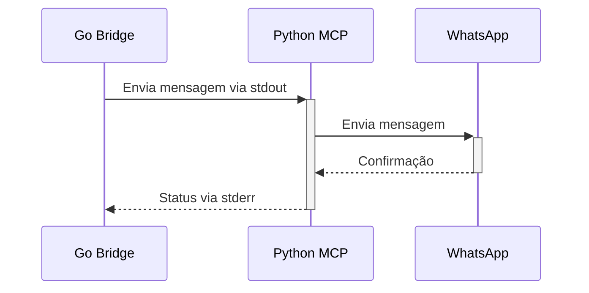

# Arquitetura

## Fluxo MCP WhatsApp-Roo

```mermaid
sequenceDiagram
    Go Bridge->>+Python MCP: Envia mensagem via stdout
    Python MCP->>+WhatsApp: Envia mensagem
    WhatsApp-->>-Python MCP: Confirmação
    Python MCP-->>-Go Bridge: Status via stderr
```
