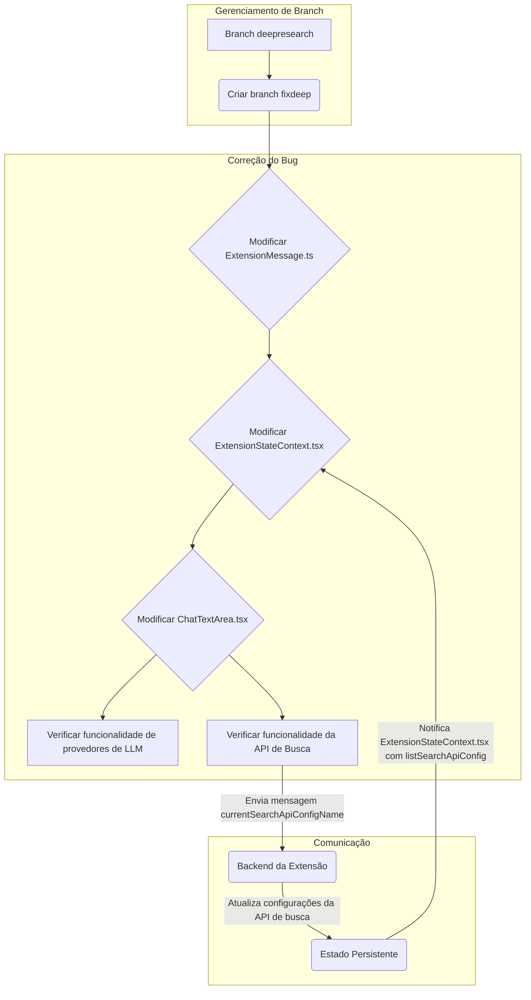

# Plano de Correção de Bug: Seleção de Perfil da API de Busca

**Objetivo:** Corrigir o bug onde o `select` de perfil de configuração da API de busca está aplicando as configurações da API de busca em vez das configurações de perfil de provedor, garantindo que a funcionalidade dos provedores de LLM não seja prejudicada e que a API de busca funcione corretamente.

## Passos Preliminares (Gerenciamento de Branch)

1.  **Criar nova branch:** Criar uma nova branch chamada `fixdeep` a partir da branch `deepresearch`.
    - **Observação:** Esta etapa será executada pelo modo "Code" após a aprovação final do plano.

## Detalhes do "Rollback" da Função de Seleção de Perfil de Provedores

O termo "rollback" aqui não se refere a uma operação de `git revert` ou `git merge` da branch `main`. Em vez disso, significa garantir que a funcionalidade de seleção de perfil de configuração para os _provedores de LLM_ (`listApiConfigMeta`, `currentApiConfigName` e suas mensagens associadas) permaneça intacta e não seja afetada pelas novas implementações para a API de busca. A "implementação em `deepresearch` que está sendo prejudicada" é a _tentativa de usar_ as propriedades dos provedores de LLM para a API de busca, o que é o cerne do bug. A correção visa _separar_ essas funcionalidades, não reverter as mudanças nos provedores de LLM em si.

## Arquivos a serem modificados

- [`src/shared/ExtensionMessage.ts`](src/shared/ExtensionMessage.ts)
- [`webview-ui/src/context/ExtensionStateContext.tsx`](webview-ui/src/context/ExtensionStateContext.tsx)
- [`webview-ui/src/components/chat/ChatTextArea.tsx`](webview-ui/src/components/chat/ChatTextArea.tsx)

## Alterações propostas

### 1. Modificação em [`src/shared/ExtensionMessage.ts`](src/shared/ExtensionMessage.ts)

- **Alteração:**
    - Adicionar as propriedades `searchApiConfigurations?: ProviderSettingsEntry[]` e `currentSearchApiConfigName?: string` à interface `ExtensionState`.
    - Adicionar um novo tipo de mensagem `currentSearchApiConfigName` à `ExtensionMessage` para permitir a comunicação da seleção do perfil de busca para o backend.
- **Justificativa:** Isso garantirá que o estado da extensão possa armazenar e comunicar corretamente as configurações da API de busca, separando-as das configurações dos provedores de LLM.

### 2. Modificação em [`webview-ui/src/context/ExtensionStateContext.tsx`](webview-ui/src/context/ExtensionStateContext.tsx)

- **Alteração:**
    - **Garantir a integridade das configurações de provedores de LLM:** As propriedades `listApiConfigMeta` e `currentApiConfigName` e seus respectivos `setters` e `message handlers` devem permanecer inalterados e funcionando corretamente para os provedores de LLM.
    - Adicionar `searchApiConfigurations?: ProviderSettingsEntry[]` e `currentSearchApiConfigName?: string` à interface `ExtensionStateContextType`.
    - Inicializar `searchApiConfigurations` como `[]` e `currentSearchApiConfigName` como `"default"` no `useState` (aproximadamente linhas 162-163).
    - Adicionar `setSearchApiConfigurations` e `setCurrentSearchApiConfigName` como funções de `setState` no `contextValue`.
    - Adicionar um novo `case "listSearchApiConfig"` no `handleMessage` para atualizar `searchApiConfigurations` e um `case "currentSearchApiConfigName"` para atualizar `currentSearchApiConfigName`.
- **Justificativa:** Isso integrará as configurações da API de busca ao estado global da extensão, tornando-as acessíveis aos componentes da UI e permitindo que o backend as atualize, sem interferir na funcionalidade existente dos provedores de LLM.

### 3. Modificação em [`webview-ui/src/components/chat/ChatTextArea.tsx`](webview-ui/src/components/chat/ChatTextArea.tsx)

- **Alteração:**
    - **Garantir a integridade da seleção de provedores de LLM:** O `SelectDropdown` existente para provedores de LLM (se houver um separado) deve continuar usando `listApiConfigMeta` e `currentApiConfigName` e o tipo de mensagem `loadApiConfigurationById`.
    - **Linhas 1009-1119 (SelectDropdown da API de Busca):**
        - Substituir `listApiConfigMeta` por `searchApiConfigurations` nas opções.
        - Substituir `currentApiConfigName` por `currentSearchApiConfigName` na propriedade `value` e na lógica de `renderItem` para determinar o item selecionado.
    - **Linha 1061 (Evento `onChange` do SelectDropdown da API de Busca):**
        - Alterar `vscode.postMessage({ type: "loadApiConfigurationById", text: value })` para `vscode.postMessage({ type: "currentSearchApiConfigName", text: value })`.
        - Ajustar a lógica para o botão "settingsButtonClicked" para direcionar para as configurações da API de busca, assumindo uma seção `section: "searchApi"`.
- **Justificativa:** Essas alterações garantirão que o `SelectDropdown` da API de busca use as propriedades corretas para exibir e gerenciar as configurações da API de busca, e que a seleção do usuário seja comunicada corretamente ao backend, sem afetar a funcionalidade dos provedores de LLM.

## Considerações adicionais

- **Chaves de tradução:** Não parece haver necessidade de novas chaves de tradução.
- **Testes:** Novos testes serão necessários para cobrir a funcionalidade da seleção da API de busca. Será importante também verificar se os testes existentes para a seleção de provedores de LLM continuam passando.
- **Backend:** As mensagens `currentSearchApiConfigName` e `listSearchApiConfig` precisarão ser tratadas no backend da extensão (em `src/extension.ts` ou módulos relacionados) para que as configurações da API de busca sejam realmente carregadas e salvas.

## Fluxo de Trabalho

